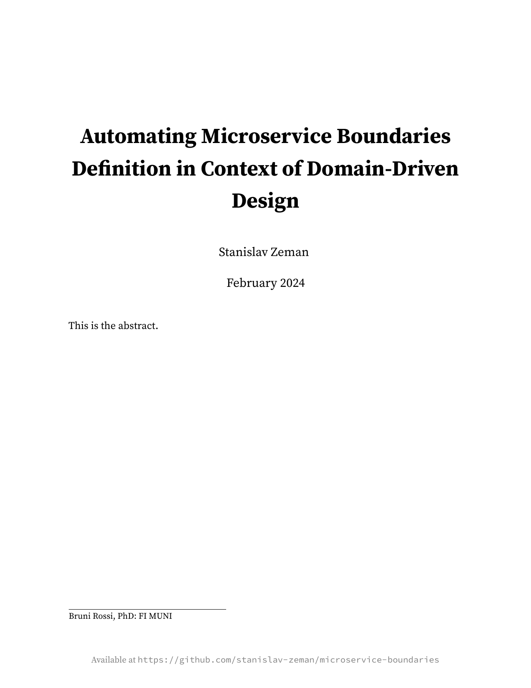

# Microservice Boundaries

This project contains a short report on defining service boundaries in microservice architecture and the posibilities of automating such activities.

## Paper

## LaTeX Template

The project uses [minimalist LaTeX template](https://github.com/pmichaillat/latex-paper) created by [Pascal Michaillat](https://github.com/pmichaillat).
